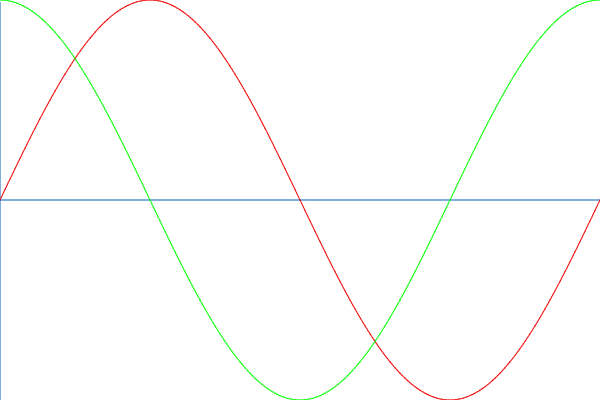
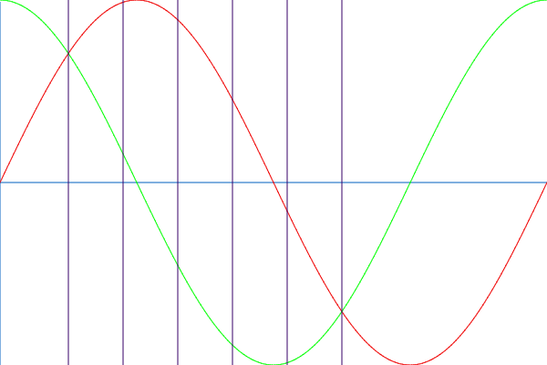
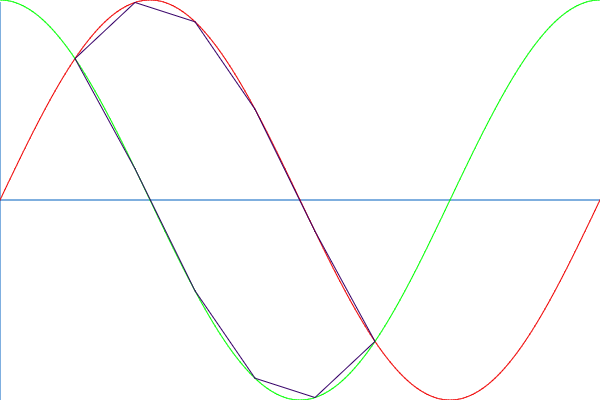
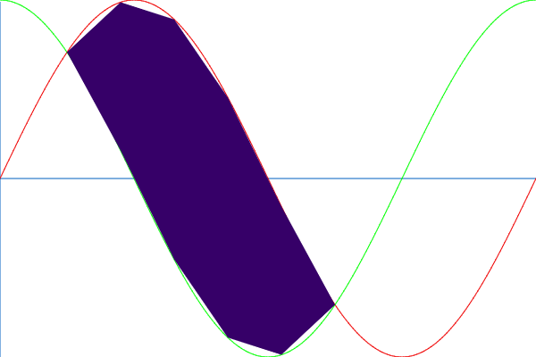

Задати синусоїду та косинусоїду на проміжку `[0..2π]`:

Інтервал `[π/4..5π/4]` поділити на `N` (3 і більше) діапазонів вертикальними лініями. У прикладі нижче `N=5`:

Точки перетину вертикальних ліній з синусоїдою та косинусоїдою послідовно з'єднати лінією:

Знайти площу утвореного полігона:

Знайдене значення вивести в консоль.

За бажанням зробити візуалізацію на канві. 